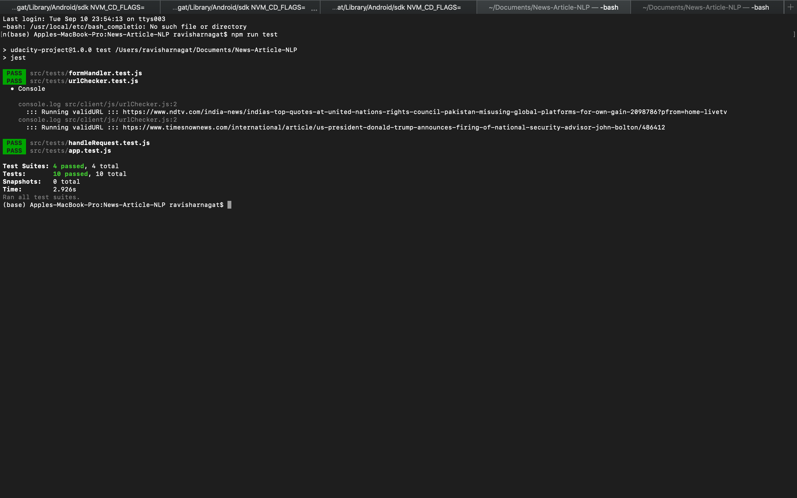

# Udacity: Evaluate a news article with Natural Language Processing

## What You Will Build

We will be building web tool that allows users to run Natural Language Processing (NLP) on articles or blogs found on other websites. Using an exciting new api called Aylien, we can build a simple web interface to interact with their NLP system. This tool will give us back pertinent information about the article, like whether the content is subjective (opinion) or objective (fact-based) and whether it is positive, neutral, or negative in tone.

Node and express will be the webserver and routing, and webpack will be our build tool of choice. Using webpack, we will set up the app to have dev and prod environments, each with their own set of tools and commands. 

## File structure
The project has the following file structure

- dist/
- src/
  - client/
    - js/
      - formHandler.js
      - urlChecker.js
    - styles/
      - ...scss files
    - views/
      - index.html
    - index.js
    
  - server/
    - app.js
    - handleRequest.js
    - server.js
  - test
    - app.test.js
    - formHandler.test.js
    - handleRequest.test.js
    - urlChecker.test.js
- .babelrc
- .gitignore
- package.json
- readme.md
- webpack.dev.js
- webpack.prod.js

## Run project
We can do it using two mode

### run in dev mode
` $ npm run build-dev`

` $ npm run start`

**Note::** The web page can be accessed witht `localhost:8080`

### run in prod mode
` $ npm run build-prod`

` $ npm run start`

**Note::** The web page can be accessed with `localhost:3000`
## Configs

The project contains a `package.json` file two webpack config files `webpack.config.dev.js` and `webpack.config.prod.js` for development and production respectfully.

When the development mode is run, it starts the webpack dev server at port 8080

## Content
The project has only one html file located in the `src/views/` folder. 
Furtermore, the project contains 2 javascript files in the `src/client/js` folder. 
The html file is styled using sass files located in the `src/client/styles ` folder.

## API
The project receives an input url from the html file and passes it to the function `handleSubmit` from the  file `formHandler.js` which calls the function `validURL` from file `urlChecker.js` to check that it is a valid url. Then a fetch is done to `http://localhost:3000/article` which then makes a post request to the api via `app.post('/article', requestPost.validateRequest, requestPost.registerPostHandler);`

`validateRequest` is also used for validation and `registerPostHandler` is used to do the request to the `aylient textapi`.

The information gotten from the api call will be displayed on the html page.

## Offline Functionality
The project have service workers set up in webpack. 

## Testing
The project has Jest installed and can be run using `npm run test`. 

## Interactions
The page built for this project is a simple one. It has a form with a single filed which receives an input. This input is checked for valid url. A helpful error message is displayed for invalid url. If the url is valid, then an api call is performed and the result displayed on the page.

